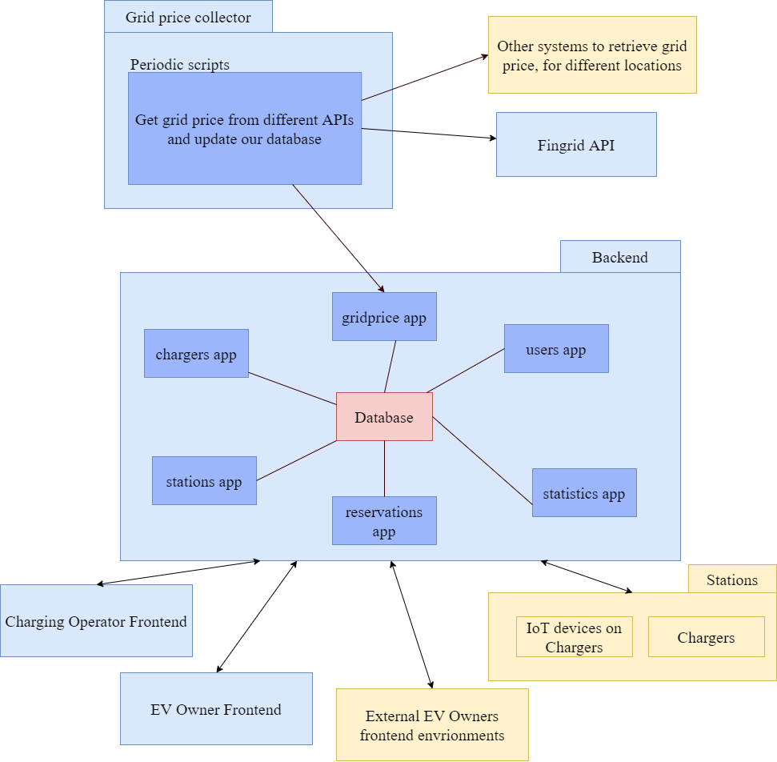
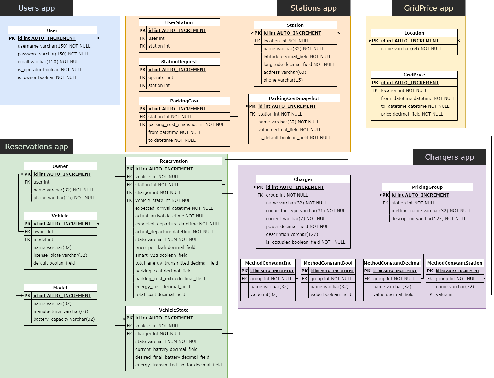

# Charging Operator

Charging operator is an app used by EV Charging Station operators, so that they can easily operate their stations. Despite the fact that it is built to make operators' lives easier, it supports some  functionality for EV owners, so that they can reserve their vehicle's charging beforehand.

This project was developed by [Markos Baratsas](https://github.com/markosbaratsas) as part of his Diploma Thesis in the [School of Electrical and Computer Engineering of NTUA](https://www.ece.ntua.gr/en).

## What this repository includes

This repository includes the following:
* **Charging Operator Frontend:** Frontend envrionment to be used by charging stations' operators and EV owners.
* **Charging Operator Backend:** Backend Environment that exposes endpoints to be used by frontend.

## System Architecture Diagram
The following diagram explains the system architecture.

## Backend ER Diagram
The backend ER diagram can be seen below.

## App screenshots
Below there are some screenshots of the Frontend Environment:

## Thesis Abstract
Energy crisis and environmental issues have encouraged the adoption of electric vehicles as an alternative transportation option to the conventional vehicles with internal combustion engines. However, to make this transition feasible, the transportation system should be properly equipped with charging stations, so that electric vehicles are able to travel without any restrictions. Apart from that, it is also important that charging stations be equipped with software that includes several smart capabilities, so that their needs are accommodated. Taking that into consideration, a web application for the charging stations' operators was implemented as part of this thesis, which focuses on the utilization of pricing strategies to dynamically produce the stations' energy prices. Specifically, charging station operators can choose the pricing strategy that better serves their motives, so that the energy prices (€/KWh) are dynamically produced based on several criteria. In addition, operators are able to easily view the state of each station (i.e. station occupancy, chargers' health status, charging reservations from EV owners, live status of charging vehicles). Meanwhile, statistics for all charging stations are automatically produced, which operators can view, so that they are able to make smart decisions. Despite the fact that this web application focuses on addressing the needs of station operators, it also includes functionality for the EV owners, who can use the app to easily make charging reservations to the stations of their choosing. This thesis initially analyzes some introductory concepts, such as the electricity market, electric vehicles and charging stations. Consequently, it analyzes the tools used for the implementation of this web application. The next chapters focus on the design and the actual implementation of the application; that is the steps followed to make the idea of this app come into reality. Finally, the last chapter focuses on presenting some use cases, so that the functionalities of the app are clearly projected.
